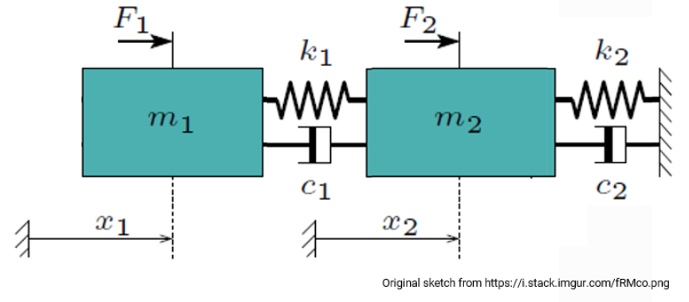

# Project02_46W38
Turbie is a simple, two-degree-of-freedom (2DOF) system based of the DTU 10 MW Reference Wind Turbine. It is equivalent to the forced 2DOF mass-spring-damper system shown below, which is defined by a mass matrix, stiffness matrix, and damping matrix.

# Discussion
The 2-DOF system was transformed into a system of first order ODEs so that it could be solve using scipy's solve_ivp. The analysis of results is focused on the position (relative displacement) of m1 (Rotor) and m2 (Hub, Nacelle and Tower). The aerodynamic force acts on the rotor only following a given Ct curve.

Wind speed simulations, covering the wind speed range: 4 - 25 m/s (both inclusive); were provided for 3 distinct levels of turbulence intensity:
* 5%
* 10%,
* 15%.

The input time series have a period of 11 min, and frequency of 100 Hz. The first minute of each input wind speed time series was skipped on the assumption that it includes transitory effects as the simulation converges.

For an input wind speed time series of 9 m/s and a TI of 15% the resulting displacements are shown in the figure below. The **rotor (m1) is shown in blue**, the **hub, nacelle and tower (m2) are shown in orange**. 

Despite the scatter of the 100 Hz points, a clear higher sensitivity of the rotor to the wind speed is easily perceived. This was expected given the fact that the aerodynamic force acts only on m1, and the realistic turbie parameters (M, C, K).

The displacement of m2, can be appreciated as well to a minor extent. From inspection, the position seems linearly dependent on the wind speed, with m1 having a higher slope. The same conclusions can be reached from inspection of the time series on the second half of the plot.

The **average displacement** of each mass was calculated for each TI-Wsp case. The next plot shows that the 10 min. avg. position is not sensitive to the turbulence intensity, but to the aerodynamic force mainly, dominated by the square of the relative wind speed and the thrust coefficient. The highest displacement corresponds to the highest force. The magnitude of displacement of m2 has the same shape but is significantly lower.

The **standard deviation of the displacement** of each mass was calculated as well for each TI-Wsp case. The plot shows that the 10 min. standard deviation continues to follow as expected the aerodynamic force, but this time it is very sensitive to the turbulence intensity.

Even with this simple 2-DOF model, the effect of the turbulence intensity on the fatigue damage and lifetime of a turbine's components, is effectively illustrated, E.g. the standard deviation of the displacement at 15% TI is around 4 times higher that at 5%.

The average and standard deviation of displacement are combined in the last plot, where the error bar has a height of plus-minus 1 std. deviation. It allows to inspect the previously shown information in a different way.

The results of each TI-Wsp case are available as text files in the output folder. The average and standard deviation of the displacements is saved in x_rel_stats.txt.